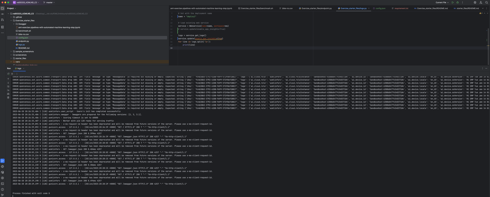
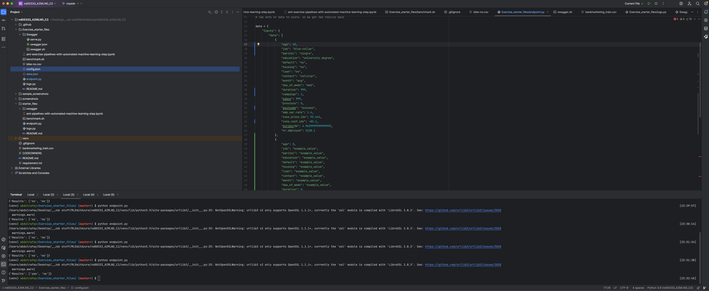
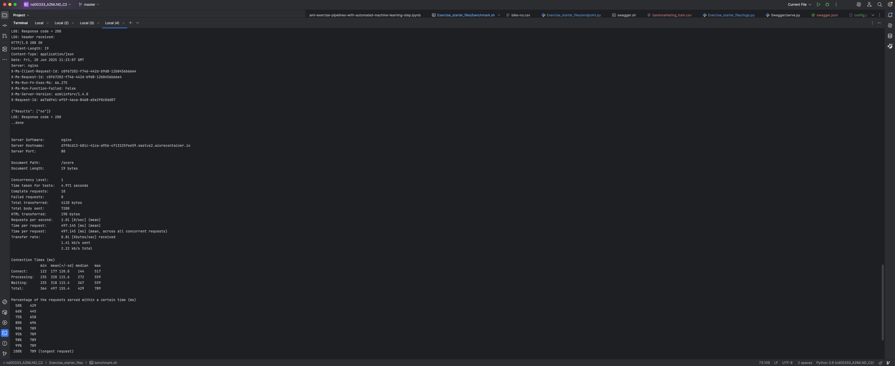
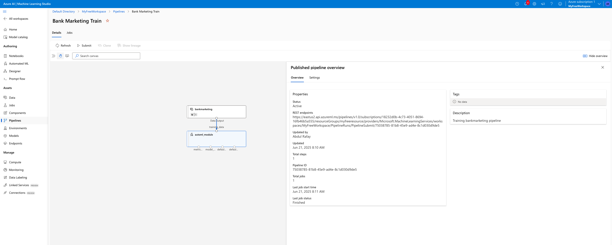

# MLOps for Bank Marketing Prediction Service
This is the Project for MLE with MS-Azure NanoDegree of Udacity.
We try to operationalize a prediction service to predict leads for Bank Marketing from the customer information, mainly attributes and credit history. First, we create an AutoML experiment and get the best model to deploy as Webservice. After deploying, we see how to enable logs and consume webservice via Restful API endpoints. We will further benchmark it to make sure everything works fine. In the end, we create and publish a pipeline based on a similar AutoML step.
The importance of pipeline can be understood from the fact that a pipeline is crucial for automating and ensuring the reproducibility of the ML workflow, enabling scalable MLOps, promoting modularity, facilitating collaboration and forming the basis for CI/CD.

# Project Architecture Diagram

## Key Steps
After running an AutoML experiment and deploying the best model as a Webservice which can be accessed by Rest endpoint as shown below.

### Step 1: AutoML Experiment
We can initiate an AutoML experiment by selecting the task at hand (Classification here) and then configuring the dataset for the experiment. Then we can set up the compute and run our experiment.

### Step 2: Best Model Deployment
Once the experiment is complete, we can deploy the best model like this. Make sure you always endable authentication.

### Step 3: App Insights
After successful deployment, we can enable app insights.
Use the [log.py](Exercise_starter_files/log.py) to enable application insights and view logs of webservice.\
From App insights, we can see the Request and Response times and manage our service resources.

### Step 4: Consuming Endpoint and Benchmarking

To consume Restful API endpoint, use the swagger documentation.
[Swagger](Exercise_starter_files/Swagger) directory is there to run server and ui to view swagger rest endpoint documentation locally.
Then use the [endpoint.py](Exercise_starter_files/endpoint.py) to consume the rest endpoint. We can also run a test to benchmark our service using Apache Benchmark.

Note: Replace the workspace and resource related configurations based on your deployments and workspace.

### Step 5: Publish Pipeline

Furthermore, We can view steps to create a Pipeline with AutoML step and Publish it in [aml-exercise-pipelines-with-automated-machine-learning-step.ipynb](Exercise_starter_files/aml-exercise-pipelines-with-automated-machine-learning-step.ipynb).

### Improvments
Since the dataset has a huge class imbalance as we can see from the dataset profiling in AzureML studio, we can consider some Data augmentation or sampling techniques to get improved results.

## Screen Recording
[Demo](https://youtu.be/kJx96wzHCaU?si=BC95V6KD16MhgIMO) of the project is presented on YouTube.
