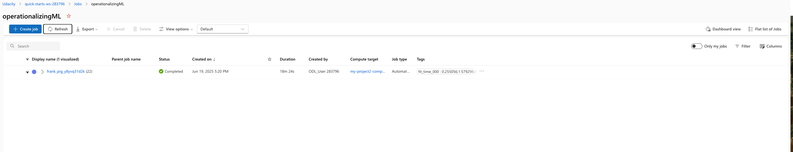

# MLOps for Bank Marketing Prediction Service
This is the Project for MLE with MS-Azure NanoDegree of Udacity.
We try to operationalize a prediction service to predict leads for Bank Marketing from the customer information of attributes and credit history. First, we create an AutoML experiment and get the best model to deploy as Webservice. After deploying, we see how to enable logs and consume our endpoint. We will further benchmark it to make sure everything works fine. In the end, we create and publish a pipeline based on a similar AutoML step.

# Project Architecture Diagram

## Key Steps
After running an AutoML experiment and deploying the best model as a Webservice which can be accessed by Rest endpoint as shown below.

Use the [log.py](Exercise_starter_files/log.py) to enable application insights and view logs of webservice. 
[Swagger](Exercise_starter_files/Swagger) directory is there to run server and ui to view swagger rest endpoint documentation locally. Then use the [endpoint.py](Exercise_starter_files/endpoint.py) to consume the rest endpoint.
Note: Replace the workspace and resource related configurations based on your deployments and workspace.

From App insights, we can see the Request and Response times and manage our service resources.

### Consume Endpoint

### Publish Pipeline
Furthermore, We can view steps to create a Pipeline with AutoML step and Publish it in [aml-exercise-pipelines-with-automated-machine-learning-step.ipynb](Exercise_starter_files/aml-exercise-pipelines-with-automated-machine-learning-step.ipynb).

### Improvments
Since the dataset has a huge class imbalance as we can see from the dataset profiling in AzureML studio, we can consider some Data augmentation or sampling techniques to get improved results.

## Screen Recording
[Demo](https://www.youtube.com/watch?v=kJx96wzHCaU) of the project is presented on YouTube.
